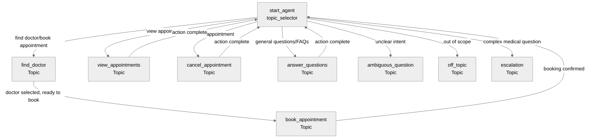

# Agent Spec: OncoGlobal_Patient_Scheduling_Agent

## Purpose & Scope

The Onco Global Patient Scheduling Agent helps patients book, manage, and inquire about medical appointments at Onco Global hospitals. It assists with finding doctors by specialty or department, checking availability, scheduling appointments, viewing existing appointments, canceling appointments, and answering frequently asked questions about services and procedures.

## Behavioral Intent

Key behavioral rules:
- **Patient Identification:** Agent must collect patient email or phone to identify/create patient records before booking appointments
- **Multilingual Support:** Respects patient's preferred language (English, Spanish, Hindi, Telugu, Tamil) when available
- **Appointment Validation:** Ensures appointments are scheduled during valid times (future dates only, respecting business hours)
- **Backing Logic:** Uses invocable Apex classes for data queries and appointment management
- **Guardrails:** Redirects off-topic requests, asks for clarification on ambiguous inputs, escalates complex medical questions
- **State Persistence:** Maintains patient context, selected doctor/hospital, and appointment details across the conversation
- **Conversation Logging:** Records conversation metadata in Agent_Conversation__c for analytics

## Topic Map

**Topic Descriptions:**
- **topic_selector (hub):** Routes users to appropriate domain topics based on intent
- **find_doctor:** Searches doctors by specialty, department, or hospital; displays results
- **book_appointment:** Collects appointment details and creates booking
- **view_appointments:** Shows patient's existing appointments
- **cancel_appointment:** Cancels a scheduled appointment
- **answer_questions:** Retrieves and presents FAQ content
- **ambiguous_question:** Clarifies unclear requests
- **off_topic:** Redirects out-of-scope requests
- **escalation:** Hands off complex medical questions to human support

## Variables

- `patient_email` (mutable string = "") — Patient's email address for identification. Set by: user input in find_doctor or view_appointments. Read by: all booking/management topics for patient lookup.

- `patient_phone` (mutable string = "") — Patient's phone number for identification. Set by: user input. Read by: patient lookup if email not provided.

- `patient_id` (mutable string = "") — Patient record ID after lookup/creation. Set by: identify_patient action. Read by: booking and appointment management actions.

- `selected_doctor_id` (mutable string = "") — ID of doctor selected for appointment. Set by: user selection in find_doctor topic. Read by: book_appointment topic for creating appointment.

- `selected_hospital_id` (mutable string = "") — ID of hospital where appointment will be scheduled. Set by: find_doctor action or user selection. Read by: book_appointment topic.

- `appointment_date_time` (mutable string = "") — Requested appointment date and time. Set by: user input in book_appointment. Read by: create_appointment action.

- `appointment_reason` (mutable string = "") — Reason for appointment/visit. Set by: user input. Read by: create_appointment action.

- `confirmation_code` (mutable string = "") — Generated confirmation code after booking. Set by: create_appointment action output. Read by: displayed to user.

## Actions & Backing Logic

### search_doctors (find_doctor topic)

- **Target:** `apex://DoctorSearchService`
- **Backing Status:** NEEDS STUB

#### Inputs

| Name | Type | Required | Source |
|------|------|----------|--------|
| specialty | string | No | User input (e.g., "oncologist", "cardiologist") |
| departmentName | string | No | User input (e.g., "Cardiology") |
| hospitalName | string | No | User input (e.g., "Onco Global Main") |

#### Outputs

| Name | Type | Visible to User? | Source | Notes |
|------|------|-------------------|--------|-------|
| doctors | list[object] | Yes | `Doctor__c` query | Doctor records with details |
| hasResults | boolean | No | Computed | Internal flag for empty results |

**complex_data_type_name:** `@apexClassType/c__DoctorSearchService$DoctorInfo`

#### Stubbing Requirement

Invocable Apex class that queries `Doctor__c` records with related `Hospital__c` and `Department__c` lookups. Filter by specialty (picklist), department name, and/or hospital name. Returns list of doctors with: Name, Specialty__c, Department__c.Name, Hospital__c.Name, Email__c, Phone__c, Bio__c, Is_Available__c.

---

### identify_patient (find_doctor, view_appointments topics)

- **Target:** `apex://PatientIdentificationService`
- **Backing Status:** NEEDS STUB

#### Inputs

| Name | Type | Required | Source |
|------|------|----------|--------|
| email | string | No | @variables.patient_email |
| phone | string | No | @variables.patient_phone |

#### Outputs

| Name | Type | Visible to User? | Source | Notes |
|------|------|-------------------|--------|-------|
| patientId | string | No | `Patient__c.Id` | Record ID for subsequent actions |
| patientName | string | Yes | `Patient__c.Name` | For greeting/confirmation |
| preferredLanguage | string | No | `Patient__c.Preferred_Language__c` | For localization |
| isNewPatient | boolean | Yes | Computed | Whether record was created |

#### Stubbing Requirement

Invocable Apex class that searches for existing `Patient__c` by email or phone. If found, returns the record ID. If not found, creates a new Patient__c record with provided email/phone and returns the new ID. Uses `WITH USER_MODE` for SOQL.

---

### create_appointment (book_appointment topic)

- **Target:** `apex://AppointmentBookingService`
- **Backing Status:** NEEDS STUB

#### Inputs

| Name | Type | Required | Source |
|------|------|----------|--------|
| patientId | string | Yes | @variables.patient_id |
| doctorId | string | Yes | @variables.selected_doctor_id |
| hospitalId | string | Yes | @variables.selected_hospital_id |
| appointmentDateTime | string | Yes | @variables.appointment_date_time |
| reason | string | No | @variables.appointment_reason |
| durationMinutes | integer | No | Defaults to 30 |

#### Outputs

| Name | Type | Visible to User? | Source | Notes |
|------|------|-------------------|--------|-------|
| appointmentId | string | No | `Appointment__c.Id` | Created record ID |
| confirmationCode | string | Yes | `Appointment__c.Confirmation_Code__c` | Auto-generated by flow |
| appointmentDateTime | datetime | Yes | `Appointment__c.Appointment_Date_Time__c` | Confirmed date/time |
| doctorName | string | Yes | `Doctor__c.Name` | Doctor's name |
| hospitalName | string | Yes | `Hospital__c.Name` | Hospital name |
| success | boolean | No | Computed | Booking status flag |
| errorMessage | string | Yes | Computed | Error details if booking fails |

#### Stubbing Requirement

Invocable Apex class that creates an `Appointment__c` record with Status__c = 'Scheduled'. Links to Patient__c, Doctor__c, and Hospital__c. Returns confirmation details. Validates appointment date is in the future (validation rule handles this). The confirmation code is auto-generated by the Generate_Appointment_Confirmation_Code flow trigger.

---

### get_appointments (view_appointments topic)

- **Target:** `apex://AppointmentRetrievalService`
- **Backing Status:** NEEDS STUB

#### Inputs

| Name | Type | Required | Source |
|------|------|----------|--------|
| patientId | string | Yes | @variables.patient_id |

#### Outputs

| Name | Type | Visible to User? | Source | Notes |
|------|------|-------------------|--------|-------|
| appointments | list[object] | Yes | `Appointment__c` query | Patient's appointments |
| hasAppointments | boolean | No | Computed | Internal flag for empty results |

**complex_data_type_name:** `@apexClassType/c__AppointmentRetrievalService$AppointmentInfo`

#### Stubbing Requirement

Invocable Apex class that queries `Appointment__c` records for the given patient, ordered by Appointment_Date_Time__c DESC. Returns appointments with: Confirmation_Code__c, Appointment_Date_Time__c, Status__c, Reason__c, Doctor__c.Name, Hospital__c.Name, Hospital__c.Address__c. Uses `WITH USER_MODE`.

---

### cancel_appointment (cancel_appointment topic)

- **Target:** `apex://AppointmentCancellationService`
- **Backing Status:** NEEDS STUB

#### Inputs

| Name | Type | Required | Source |
|------|------|----------|--------|
| confirmationCode | string | Yes | User input |
| patientId | string | Yes | @variables.patient_id |

#### Outputs

| Name | Type | Visible to User? | Source | Notes |
|------|------|-------------------|--------|-------|
| cancelled | boolean | Yes | Computed | Success flag |
| appointmentDetails | string | Yes | Computed | Summary of cancelled appointment |
| errorMessage | string | Yes | Computed | Error if cancellation fails |

#### Stubbing Requirement

Invocable Apex class that finds `Appointment__c` by Confirmation_Code__c and Patient__c, validates it can be cancelled (not in the past per validation rule), updates Status__c to 'Cancelled'. Returns success/failure with details.

---

### search_faqs (answer_questions topic)

- **Target:** `apex://FAQSearchService`
- **Backing Status:** NEEDS STUB

#### Inputs

| Name | Type | Required | Source |
|------|------|----------|--------|
| searchQuery | string | Yes | User question |
| category | string | No | Optional category filter |

#### Outputs

| Name | Type | Visible to User? | Source | Notes |
|------|------|-------------------|--------|-------|
| faqs | list[object] | Yes | `FAQ_Content__c` query | Matching FAQ entries |
| hasResults | boolean | No | Computed | Internal flag for empty results |

**complex_data_type_name:** `@apexClassType/c__FAQSearchService$FAQInfo`

#### Stubbing Requirement

Invocable Apex class that searches `FAQ_Content__c` records where Question__c or Answer__c contains the search query (case-insensitive). Optionally filters by Category__c. Returns FAQ records with: Question__c, Answer__c, Category__c. Uses `WITH USER_MODE`.

---

### log_conversation (all topics - after_reasoning)

- **Target:** `apex://ConversationLogger`
- **Backing Status:** NEEDS STUB

#### Inputs

| Name | Type | Required | Source |
|------|------|----------|--------|
| patientId | string | No | @variables.patient_id |
| intent | string | Yes | Current topic name |
| sessionId | string | Yes | System-generated |
| outcome | string | No | Action result summary |

#### Outputs

| Name | Type | Visible to User? | Source | Notes |
|------|------|-------------------|--------|-------|
| logged | boolean | No | Computed | Success flag (silent) |

#### Stubbing Requirement

Invocable Apex class that creates an `Agent_Conversation__c` record to log the conversation. Fields: Patient__c (if available), Intent__c, Session_ID__c, Outcome__c. This is for analytics only - failures should not block the user experience.

## Gating Logic

- **identify_patient** action visibility: `available when @variables.patient_email != "" or @variables.patient_phone != ""` — Patient identification requires at least one contact method.

- **create_appointment** action visibility: `available when @variables.patient_id != "" and @variables.selected_doctor_id != "" and @variables.appointment_date_time != ""` — All required booking information must be collected before creating appointment.

- **get_appointments** action visibility: `available when @variables.patient_id != ""` — Patient must be identified before retrieving their appointments.

- **cancel_appointment** action visibility: `available when @variables.patient_id != ""` — Patient must be identified before canceling appointments.

- **Transition to book_appointment topic:** Only available after doctor is selected in find_doctor topic (`selected_doctor_id` is set).

## Architecture Pattern

**Hub-and-Spoke** with central routing:

- **Hub:** `topic_selector` serves as the main routing point
- **Spokes:** Domain topics (find_doctor, book_appointment, view_appointments, cancel_appointment, answer_questions)
- **Routing Strategy:** User intent determines initial routing. After completing actions in spoke topics, users can transition to other spokes or return to hub for new requests.
- **Delegation Pattern:** `find_doctor` delegates to `book_appointment` when doctor is selected
- **Guardrail Topics:** `ambiguous_question`, `off_topic`, and `escalation` handle edge cases

## Agent Configuration

- **developer_name:** `OncoGlobal_Patient_Scheduling_Agent`
- **agent_label:** `Onco Global Patient Scheduler`
- **agent_type:** `AgentforceServiceAgent` — This is a customer-facing agent for patients scheduling appointments through a public channel
- **default_agent_user:** TBD (requires Einstein Agent User setup)
- **welcome_message:** "Welcome to Onco Global! I'm here to help you schedule appointments, find doctors, and answer questions about our services. How can I assist you today?"
- **error_message:** "I apologize, but I'm experiencing technical difficulties. Please try again in a moment, or contact our support team for immediate assistance."

## Additional Notes

**Data Model Integration:**
- Leverages existing custom objects: Hospital__c, Department__c, Doctor__c, Patient__c, Appointment__c, FAQ_Content__c, Agent_Conversation__c
- Existing automation (Generate_Appointment_Confirmation_Code flow) handles confirmation code generation
- Validation rules prevent scheduling past appointments and canceling past appointments

**Multi-language Consideration:**
- Patient__c.Preferred_Language__c tracks patient preference
- Future enhancement: Use language preference to customize agent responses

**Security:**
- All Apex uses `WITH USER_MODE` for field-level security
- Patient data access controlled through sharing rules
- Einstein Agent User requires appropriate permission sets

**Next Steps:**
1. Confirm target org has Einstein Agent User or create one
2. Generate authoring bundle
3. Create invocable Apex stubs for all 7 actions
4. Write Agent Script code following hub-and-spoke pattern
5. Test with live preview using --use-live-actions